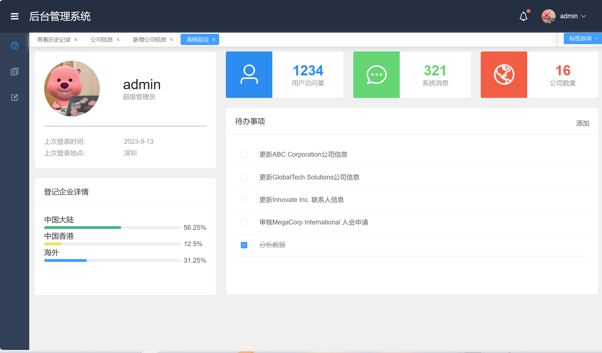
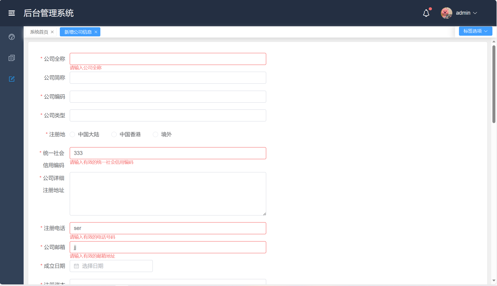
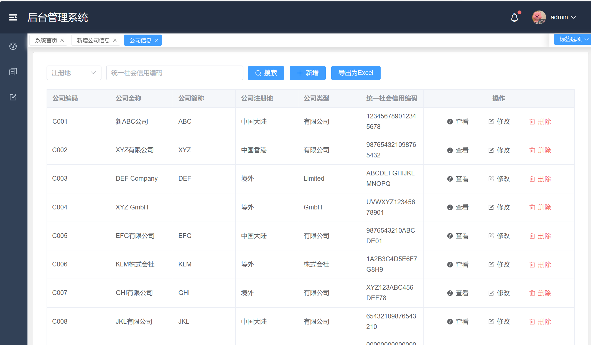
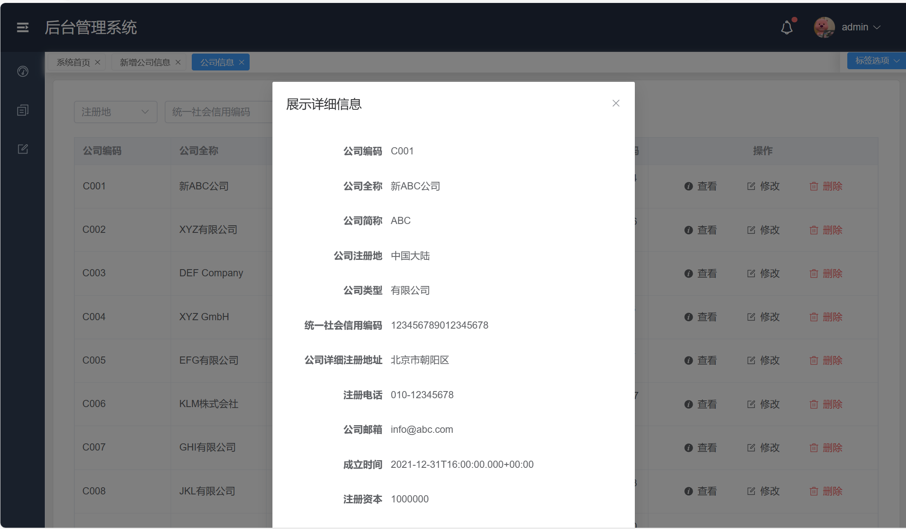
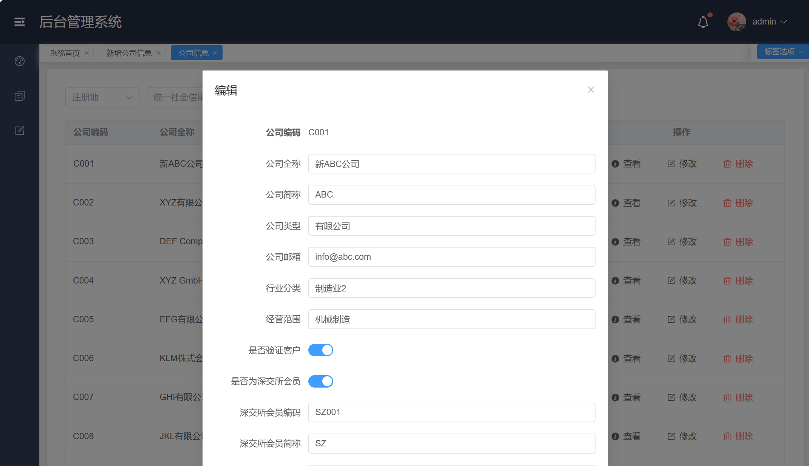

# DataNexus

一个简单的客户信息管理系统，使用SpringBoot技术，实现对公司信息的增删改查操作。系统使用JDBC进行数据库访问，不使用任何框架。前端基于Vue设计。

## 功能
-   [x] 录入公司信息
-   [x] 修改公司信息
-   [x] 删除公司信息
-   [x] 查询公司信息（分页查询）
-   [x] 数据导出
-   [x] 查询历史记录

## 安装步骤
> 因为使用vite3，node版本需要 14.18+，后端使用Java8。

```
git clone https://github.com/shen-wenxin/DataNexus.git  

// 前端    
cd vue-manage-system    // 进入模板目录
npm install         // 安装项目依赖

// 运行
npm run dev // 正常来说会占用5173端口

// 执行构建命令，生成的dist文件夹放在服务器下即可访问
npm run build

// 后端
cd customer-management
mvn clean install // 安装项目依赖

// 运行
mvn spring-boot:run // 正常来说会占用8080端口
```

需要注意的是，请尽量使用8080端口及5173端口，如您需要更改，需要自行修改代码。

## 说明
数据库文档及释义请参考``./doc/Company_Information_Scheme_v2`` 。

### 项目结构
#### 后端
后端项目在customer-management文件夹中。
```
├── src
│   ├── main
│       ├── java
│          └── com
│              └── szsc
│                  └── customermanagement
│                      ├── config
│                      ├── controller
│                      ├── dto
│                      ├── entity
│                      ├── exception
│                      ├── repository
│                      ├── service
│                      ├── utils
│                      └──customerManagementApplication.java
│
└── pom.xml
```
其中：

- config：包含项目的配置类，用于配置和初始化应用程序的各种设置。
- controller：包含控制器类，用于处理请求和响应，将请求转发到适当的服务进行处理并返回响应。
- dto：包含数据传输对象（DTO）类，用于在不同层之间传递数据，用于在控制器和服务之间进行数据传递和转换。
- entity：包含实体类，用于表示数据模型和实体，在数据库中存储和检索数据。
- exception：包含自定义异常类，用于处理项目中的异常情况并进行适当的异常处理和响应。
- repository：包含仓库类，用于与数据存储（如数据库）进行交互，执行数据的持久化和检索操作。
- service：包含服务类，提供业务逻辑的实现，协调不同的组件和功能，处理业务规则和操作数据。
- utils：包含通用的工具类，提供各种辅助方法和功能，用于在项目中的不同部分重复使用。
-customerManagementApplication.java：Spring Boot 应用程序的入口点，其中包含 main 方法，用于启动应用程序。

#### 前端

前端项目在vue-manage-system中。
```
├── src
│   ├── assets
│   ├── components
│   ├── router
│   ├── store
│   ├── views
│   ├── App.vue
│   └── main.js
└── public
    ├── index.html
    └── ...
└── package.json
```
其中：

- assets：包含项目的静态资源文件，如图片、样式表等。
- components：包含 Vue 组件文件，组件用于构建应用程序的不同部分。
- router：包含 Vue Router 路由配置文件，用于定义应用程序的路由规则。
- store：包含 Vuex 状态管理文件，用于管理应用程序的全局状态。
- views：包含视图组件文件，每个视图对应一个路由页面。
- App.vue：根组件，是所有其他组件的父组件。
- main.js：应用程序的入口文件，用于初始化 Vue 应用程序并配置全局插件和组件。

## 项目截图
### 首页
提供公司数量统计功能及公司注册地分布分析功能。
<div style="text-align: center;">
  
</div>

### 新增公司
做了简单的边界限制，如限制手机号的格式，邮箱，统一社会信用编码，身份证号的格式，以及设置了必填项，如公司全称，公司编码等。
<div style="text-align: center;">
  
</div>

### 查看公司
分页展示
<div style="text-align: center;">
  
</div>
细节展示
<div style="text-align: center;">
  
</div>

### 编辑信息
同样也做了简单的边界限制。
<div style="text-align: center;">
  
</div>

### 删除
删除按钮在查看信息的表格最后一列。

## 结果
功能测试结果请参考`./doc/test/测试文档。`

基本功能均已完成，仅做了简单的功能测试，输入信息已在前端做合法性限制。

未进行压力测试，未进行性能测试。

## 参考
[vue-manage-system](https://github.com/lin-xin/vue-manage-system)


