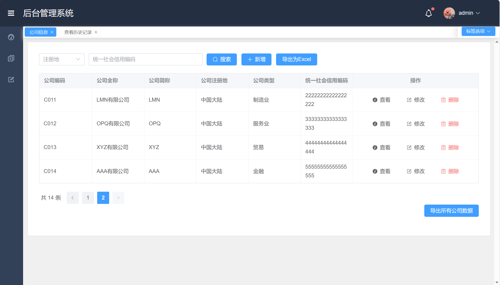

# 文档

## 测试功能

### 查看公司列表
#### 展示
向数据库中插入14条测试用例作为测试。可见`insert_data.py`。
初步测试可以完成正常显示。

  

### 录入公司信息
在录入界面录入信息。

  

初步可看可完成录入。

  

### 修改公司信息

尝试将`ABC公司`的全称修改为 `新ABC公司`

  

初步测试已经完成。

  

### 查询公司信息

可按照注册地（中国大陆、中国香港、境外）进行查询。
可以按照统一社会信用编码进行查询。

  

### 删除公司信息
可直接删除

  

### 数据导出
可以直接导出全部数据

  

或者直接导出分页数据。

  

### 查询历史

可以直接查询到修改记录，包括`Create`, `update`, `delete`。

  

可通过修改类型进行查找，或者通过公司编码查找。

  

同样支持历史数据导出。

